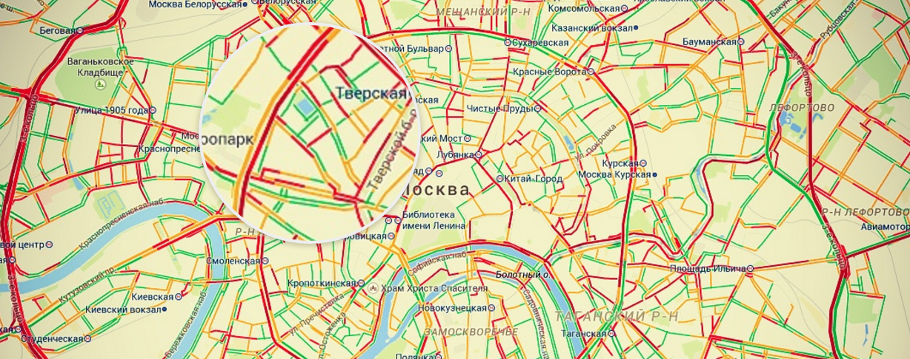

# magnifier

> Magnifier an image



## Install

```sh
npm install --save magnifier
```

## Usage

```js
import Magnifier from 'magnifier';

new Magnifier('.image');
```

## API

### new Magnifier(image)

Create a new `Magnifier` instance.

#### image

Type: `element`, `string`

Image for magnification.

### .height(h)

#### h

Type: `number`, `string`

Lens height.

### .width(h)

#### h

Type: `number`, `string`

Lens width.

### .backgroundColor(color)

#### color

Type: `string`

Lens background color.

### .borderColor(color)

#### color

Type: `string`

Lens border color.

### .borderRadius(r)

#### r

Type: `number`, `string`

Lens radius.

### .borderWidth(w)

#### w

Type: `number`, `string`

Lens border width.

### .className(name)

#### name

Type: `string`

Lens class name.

### .show()

Forced show lens.

### .hide()

Forced hide lens.

## License

MIT
